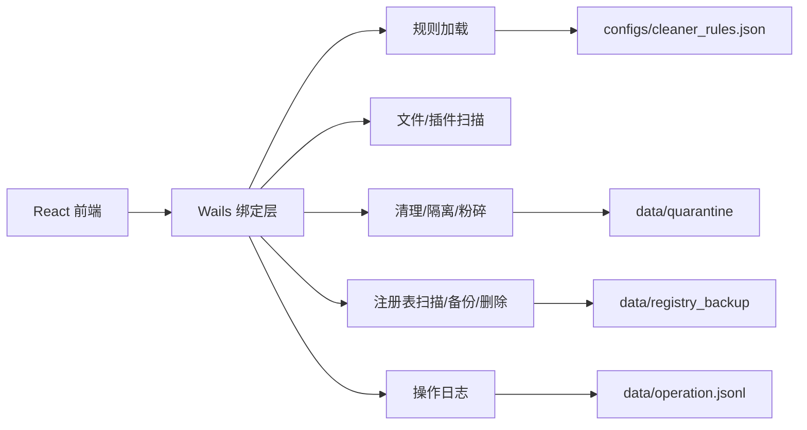

# GoCleaner 实训报告

> 项目名称：GoCleaner Windows 空间清理工具  
> 技术路线：Go + Wails + React + TypeScript + JSON 规则文件  
> 日期：2026-06-13  

---

## 1. 项目背景

本项目来源于“操作系统空间清理工具的设计与实现”课程实训任务，目标是在有限周期内实现一个可运行、可演示、可测试、可写报告的 Windows 空间清理工具。

项目覆盖任务书要求的五类功能：

```text
系统日志、缓存、临时文件清理
软件产生的可清理文件清理
隐私痕迹和无效注册表处理
不必要插件扫描或清理
垃圾文件粉碎
```

GoCleaner 的定位不是替代商业清理软件，而是实现课程实训场景下安全可控的清理流程。项目重点放在扫描预览、风险分级、确认流程、失败可见、日志留痕和测试文档。

## 2. 需求分析

系统需求可归纳为三类：

| 类别 | 需求 |
| --- | --- |
| 功能需求 | 扫描临时文件和缓存、展示结果、勾选清理、插件扫描、注册表无效项扫描和备份、文件粉碎、操作日志 |
| 安全需求 | 高风险默认不选、注册表先备份再修改、浏览器敏感数据禁止清理、QQ/微信核心数据禁止清理 |
| 交付需求 | 有可运行程序、测试记录、核心截图、系统分析/设计/实现测试文档和实训报告 |

系统设计遵循以下原则：

```text
安全优先
扫描先于清理
预览先于删除
高风险默认不选
注册表先备份再修改
失败必须可见
操作必须留痕
```

## 3. 技术选型

| 技术 | 用途 | 选择原因 |
| --- | --- | --- |
| Go | 后端核心逻辑 | 标准库适合文件 IO、路径处理、测试和 Windows 调用封装 |
| Wails | 桌面应用框架 | 将 Go 后端和 Web 前端组合成 Windows 桌面程序 |
| React + TypeScript | 前端 UI | 便于实现表格、筛选、确认弹窗和状态反馈 |
| JSON | 清理规则 | 清理路径可配置，不硬编码在扫描逻辑中 |
| JSONL | 操作日志 | 一行一条记录，便于追加、读取和展示 |

## 4. 系统设计

总体架构如下：



模块职责：

| 模块 | 说明 |
| --- | --- |
| `internal/rules` | 加载和校验清理规则，拒绝敏感浏览器数据和非法风险等级 |
| `internal/scanner` | 扫描文件和浏览器插件，生成 `ScanItem` |
| `internal/cleaner` | 删除文件、插件隔离、文件粉碎，并记录失败原因 |
| `internal/registry` | 限定扫描 HKCU Run，删除前导出 `.reg` 备份 |
| `internal/logger` | 写入和读取 JSONL 操作日志 |
| `frontend/src` | 展示扫描结果、风险标签、确认弹窗、结果反馈和日志 |

详细设计见 `docs/系统设计文档.md`。

## 5. 功能实现

### 5.1 文件扫描与清理

扫描逻辑从 JSON 规则读取路径、匹配模式、排除项、风险等级和默认勾选状态。扫描时展开环境变量和通配符，遍历目录后返回扫描项。高风险项即使规则配置为默认选中，也会被强制取消默认勾选。

清理逻辑只处理用户选中的普通文件。删除前重新校验文件存在性和文件类型，失败时记录具体原因，例如文件不存在、文件被占用、权限不足或非普通文件。

### 5.2 插件扫描与隔离

插件扫描读取 Chrome / Edge 的 `Extensions` 目录，解析扩展的 `manifest.json`，展示扩展名、版本、Profile、目录大小和路径。插件默认不删除，用户可选择移动到隔离区。隔离区记录原路径和隔离路径，便于后续恢复。

### 5.3 注册表无效项处理

注册表功能只扫描：

```text
HKCU\Software\Microsoft\Windows\CurrentVersion\Run
```

程序解析启动项命令，判断目标路径是否存在，仅展示无效项。删除前必须导出 `.reg` 备份，备份失败时拒绝删除，避免无法恢复。

### 5.4 文件粉碎

文件粉碎入口要求用户手动选择单个普通文件，并进行二次确认。程序支持 1 / 3 / 7 次覆写，每次覆写后 `Sync`，然后随机重命名并删除文件。

限制说明：

```text
SSD、NTFS 日志、系统缓存、云同步目录等场景下，无法保证专业取证级不可恢复。
```

本项目实现的是教学意义上的覆写删除。

### 5.5 体验完善

前端实现了扫描进度、应用内确认弹窗、空结果、失败结果、部分成功结果和权限不足提示。普通清理、插件隔离、注册表删除、文件粉碎均有确认流程，高风险操作保留二次确认。

## 6. 测试结果

测试以临时目录和构造数据为主，不对真实系统目录做破坏性操作。默认测试命令：

```powershell
go test ./...
go vet ./...
cd frontend
npm run test:summary
npm run build
```

测试覆盖：

| 测试类别 | 覆盖点 |
| --- | --- |
| 文件扫描测试 | 文件匹配、大小统计、通配符、排除规则、MinAgeDays、高风险默认不选 |
| 删除失败测试 | 缺失文件、非普通文件、被占用文件、权限不足分类 |
| 插件扫描测试 | manifest 读取、本地化名称、多版本目录、坏 manifest 继续扫描 |
| 注册表备份测试 | `.reg` 转义、ExpandString 编码、备份失败拒绝删除 |
| 文件粉碎测试 | 确认要求、非法 passes、目录/符号链接拒绝、覆写删除 |

详细测试用例表见 `docs/实现与测试文档.md`。

## 7. 运行截图

截图素材统一放在 `docs/images/`。当前截图清单：

| 截图 | 说明 |
| --- | --- |
| `docs/images/01-main-ui.png` | 主界面、扫描入口、风险统计、结果表格和日志区 |
| `docs/images/02-confirm-dialog.png` | 清理确认弹窗示例 |
| `docs/images/03-result-states.png` | 清理结果、部分成功、权限不足提示示例 |
| `docs/images/04-test-output.png` | 测试命令输出或测试记录截图 |

当前环境未注入 Wails 后端绑定，截图主要用于报告排版和答辩说明：`01-main-ui.png` 根据当前 Vite 前端预览页面渲染整理，`02-confirm-dialog.png` 和 `03-result-states.png` 根据第 16-17 天交互状态整理，`04-test-output.png` 根据本轮验证命令输出整理。正式演示时应在 Wails 桌面运行环境中按相同清单补拍真实扫描、清理和日志页面截图。

## 8. 风险控制总结

| 风险功能 | 控制方式 |
| --- | --- |
| 系统目录清理 | high 风险，默认不选，二次确认，失败原因可见 |
| 浏览器数据 | 只清理 Cache / Code Cache / GPUCache / ShaderCache，不清理 History / Cookies / Login Data |
| QQ / 微信数据 | 禁止清理聊天记录、图片、文件、数据库和账号相关文件 |
| 注册表 | 仅 HKCU Run，无效项展示，删除前备份，备份失败拒绝删除 |
| 插件 | 默认只展示，可选隔离，不直接自动删除 |
| 文件粉碎 | 手动单文件，二次确认，说明不可保证取证级不可恢复 |

## 9. 问题与改进

当前版本仍有可改进点：

```text
1. 扫描进度为阶段式近似进度，未做精确文件总数预统计
2. 插件是否“不必要”仍由用户判断，未实现风险评分
3. 注册表范围仅限 HKCU Run，未扩展 RecentDocs 等路径
4. 文件粉碎不能解决 SSD 和云同步场景的数据残留
5. UI 仍以单页工作台为主，后续可拆分为扫描、日志、设置等标签页
```

这些限制均是为了保证实训版本安全、可演示、可测试。

## 10. 总结

GoCleaner 完成了 Windows 空间清理工具的核心闭环：规则加载、文件扫描、结果预览、风险分级、确认清理、失败记录、操作日志、插件扫描、注册表备份删除和文件粉碎。项目覆盖任务书五类功能，并通过测试文档和截图材料支持课程答辩。

本项目的重点不是追求危险的深度清理，而是通过安全边界、确认流程和测试证据说明：系统工具类软件必须先保证用户数据安全，再考虑清理能力。
