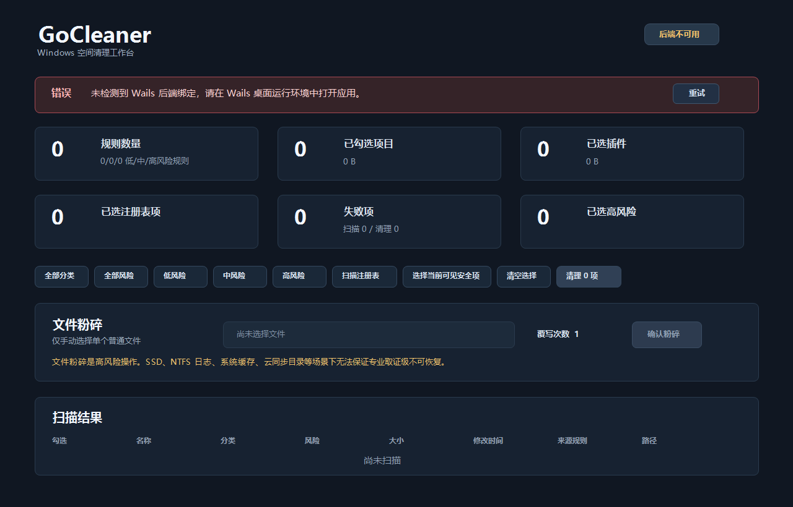
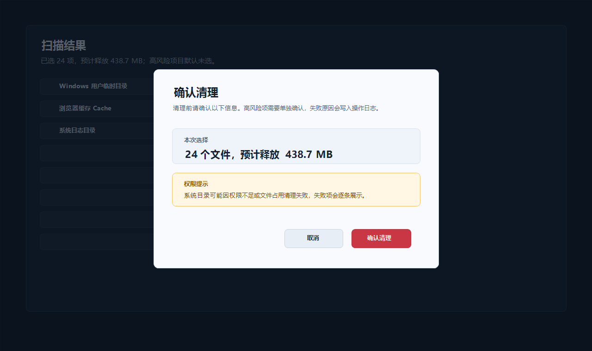
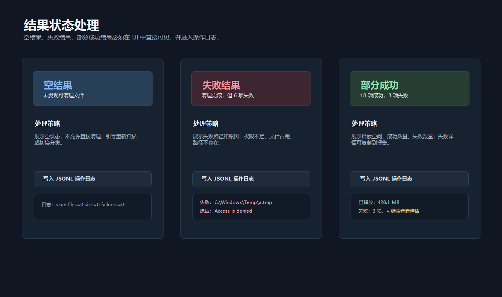
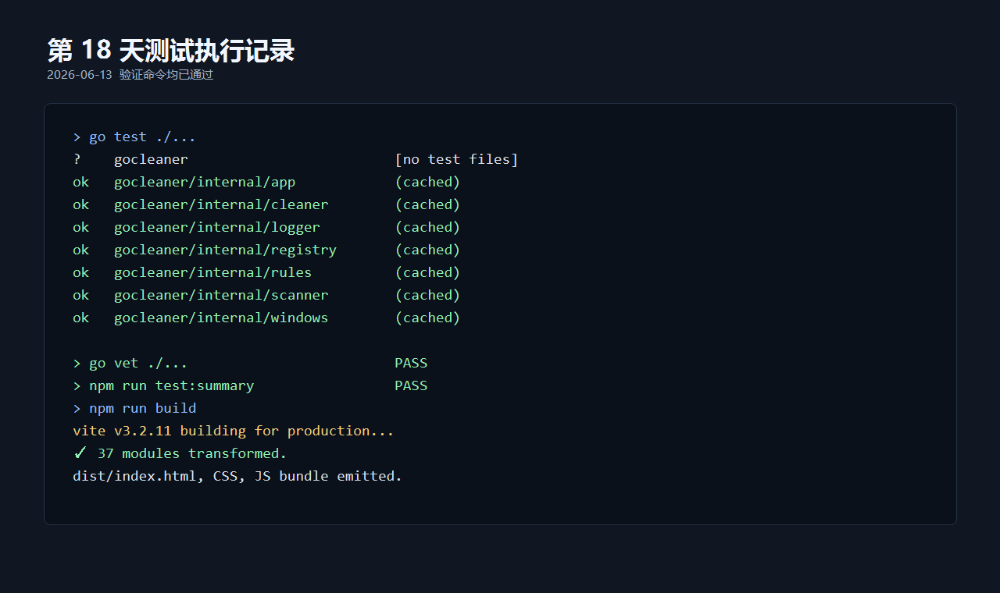

# GoCleaner 实训报告

> 项目名称：GoCleaner Windows 空间清理工具
> 技术路线：Go + Wails + React + TypeScript + JSON 规则文件
> 项目版本：GoCleaner v1.0.0
> 报告日期：2026-06-21

---

## 一、实训任务概述

### 1.1 任务来源

本项目来源于“操作系统空间清理工具的设计与实现”课程实训任务。实训目标是在规定周期内完成一款面向 Windows 桌面环境的空间清理工具，使其具备可运行、可演示、可测试、可撰写报告的完整交付能力。

GoCleaner 的目标不是替代 360、火绒等成熟商业清理软件，而是在课程实训范围内实现一个安全可控、逻辑清晰、风险边界明确的系统清理工具。项目重点放在扫描预览、风险分级、确认流程、失败可见、日志留痕和测试文档上。

### 1.2 主要任务

根据任务书要求，GoCleaner 覆盖以下五类核心功能：

    系统日志、缓存、临时文件清理
    软件产生的可清理文件清理
    隐私痕迹和无效注册表处理
    不必要插件扫描或清理
    垃圾文件粉碎

结合课程交付要求，本项目最终需要满足：

| 交付目标 | 说明 |
| --- | --- |
| 程序可启动 | 通过 Wails 将 Go 后端和 React 前端打包为 Windows 桌面程序 |
| 可以完成扫描 | 支持根据 JSON 规则扫描临时文件、缓存、插件和注册表无效项 |
| 可以展示结果 | 在前端表格中展示路径、大小、分类、风险等级和默认勾选状态 |
| 可以安全清理 | 默认只清理低风险文件，高风险项目必须人工选择并确认 |
| 可以记录日志 | 使用 JSONL 记录扫描、清理、粉碎、注册表备份和失败原因 |
| 可以演示专项功能 | 支持插件扫描、注册表无效项扫描与备份、文件粉碎 |
| 有测试和文档 | 提供测试记录、截图素材、系统分析文档、系统设计文档和本实训报告 |

### 1.3 技术路线

项目采用 Go + Wails + React + TypeScript + JSON 规则文件的技术路线：

| 技术 | 用途 | 选择原因 |
| --- | --- | --- |
| Go | 后端核心逻辑 | 标准库适合文件 IO、路径处理、错误处理、测试和 Windows API 封装 |
| Wails | 桌面应用框架 | 将 Go 后端能力暴露给 Web 前端，生成 Windows 桌面应用 |
| React + TypeScript | 前端界面 | 适合实现扫描入口、结果表格、筛选、确认弹窗和状态反馈 |
| JSON | 清理规则 | 把清理路径和匹配规则从代码中分离，便于扩展和审查 |
| JSONL | 操作日志 | 一行一条日志，便于追加写入、读取展示和后续统计 |

---

## 二、系统分析：即需求分析

### 2.1 功能需求分析

GoCleaner 的功能需求可以分为扫描、清理、专项工具和日志四部分。

| 需求类别 | 具体需求 |
| --- | --- |
| 文件扫描 | 按规则扫描用户临时目录、应用缓存目录、浏览器缓存目录、系统高风险目录 |
| 文件清理 | 用户勾选后执行清理，统计删除数量、释放空间和失败路径 |
| 插件扫描 | 扫描 Chrome / Edge 扩展目录，读取 manifest，展示插件名称、版本、路径和大小 |
| 插件隔离 | 对用户选择的插件目录执行隔离移动，而不是默认直接删除 |
| 注册表处理 | 仅扫描明确列出的安全路径，展示无效启动项，删除前导出 .reg 备份 |
| 文件粉碎 | 支持用户手动选择单个普通文件，执行 1 / 3 / 7 次覆写、同步、重命名和删除 |
| 操作日志 | 记录时间、操作类型、扫描文件数、清理文件数、释放空间、失败路径和失败原因 |

### 2.2 安全需求分析

清理工具的核心风险是误删、越权删除和不可恢复。因此本项目把安全需求作为系统设计的前置约束：

    安全优先
    扫描先于清理
    预览先于删除
    高风险默认不选
    注册表先备份再修改
    失败必须可见
    操作必须留痕

具体安全边界如下：

| 风险对象 | 控制策略 |
| --- | --- |
| 系统目录 | C:\Windows\Temp、C:\Windows\Logs、C:\Windows\SoftwareDistribution\Download 标记为 high 风险，默认不勾选 |
| 浏览器隐私数据 | 只允许处理 Cache、Code Cache、GPUCache、ShaderCache，不删除 History、Cookies、Login Data、Web Data、Preferences |
| QQ / 微信数据 | 不清理聊天记录、图片、文件、数据库和账号相关文件，仅允许通过规则处理日志、缓存和临时文件 |
| 注册表 | 禁止全注册表扫描，只扫描明确列出的安全路径；删除前必须导出备份并二次确认 |
| 文件粉碎 | 只处理用户手动选择的单个普通文件，并说明 SSD、NTFS 日志、系统缓存、云同步目录下无法保证取证级不可恢复 |

### 2.3 非功能需求分析

系统还需要满足以下非功能需求：

| 类型 | 要求 |
| --- | --- |
| 可用性 | 前端界面提供扫描入口、结果表格、分类筛选、风险展示、确认弹窗和结果反馈 |
| 可维护性 | 采用模块化目录结构，扫描、清理、规则、日志、注册表和 Windows API 封装分离 |
| 可扩展性 | 清理规则通过 configs/cleaner_rules.json 配置，新规则不应直接写死在扫描代码中 |
| 可测试性 | 核心逻辑可用临时目录和构造数据测试，不依赖真实系统目录做破坏性测试 |
| 可审计性 | 关键操作写入 data/operation.jsonl，失败原因不能静默忽略 |
| 兼容性 | 面向 Windows 10 / Windows 11，普通权限可运行，高风险路径失败时提示原因 |

---

## 三、系统开发：总体设计，详细设计，编码及测试，编程的技巧

### 3.1 总体设计

项目采用前后端分离但同进程打包的桌面应用结构。Go 负责核心业务逻辑，React 负责桌面 UI 展示，Wails 绑定层负责连接前端操作和后端服务。

    React + TypeScript 前端
        -> Wails 绑定层
        -> internal/rules 规则加载
        -> internal/scanner 文件扫描和插件扫描
        -> internal/cleaner 清理、隔离和粉碎
        -> internal/registry 注册表扫描、备份和删除
        -> internal/logger 操作日志

主要目录结构如下：

    GoCleaner
    ├── frontend/              React + TypeScript 前端
    ├── internal/
    │   ├── app/               Wails 绑定层与应用服务
    │   ├── scanner/           文件扫描和插件扫描
    │   ├── cleaner/           文件清理、隔离、粉碎
    │   ├── rules/             JSON 规则加载和校验
    │   ├── registry/          注册表启动项扫描、备份和删除
    │   ├── windows/           Windows 环境变量和注册表 API 封装
    │   ├── paths/             数据目录和运行路径处理
    │   ├── model/             数据结构定义
    │   └── logger/            JSONL 操作日志
    ├── configs/               清理规则文件
    ├── data/                  运行日志、备份和隔离区
    └── docs/                  实训文档和截图

### 3.2 详细设计与功能实现

#### 3.2.1 规则加载模块

规则文件位于 configs/cleaner_rules.json。每条规则描述清理名称、分类、路径、匹配模式、排除项、风险等级、最小文件年龄和默认勾选状态。

| 字段 | 含义 |
| --- | --- |
| name | 规则名称，例如 Chrome Cache |
| category | 分类，例如 system、software、privacy、plugin |
| paths | 扫描路径，支持环境变量和通配符 |
| patterns | 文件匹配模式 |
| exclude | 排除路径或排除模式 |
| risk | 风险等级，分为 low、medium、high |
| min_age_days | 最小文件年龄，避免清理刚生成的文件 |
| default_on | 默认是否勾选，高风险会被强制关闭 |

规则加载时会校验风险等级、路径和匹配模式。无效规则记录错误并跳过，不让单条错误配置导致程序崩溃。涉及系统目录和敏感数据的规则必须标记为高风险或禁止进入清理列表。

#### 3.2.2 文件扫描与清理模块

文件扫描模块根据规则展开环境变量和通配符，遍历目标目录后生成扫描项。扫描结果包含路径、名称、类型、分类、大小、风险等级、来源规则和是否默认选中。高风险项目即使规则中配置为默认开启，也会在程序中强制改为默认不选。

清理模块只处理用户确认后的普通文件。执行删除前重新检查路径存在性和文件类型，避免扫描后文件状态变化造成误操作。删除失败时按照文件不存在、非普通文件、被占用、权限不足等原因记录到结果和操作日志中。

#### 3.2.3 插件扫描与隔离模块

插件扫描模块读取 Chrome 和 Edge 的 Extensions 目录，解析扩展的 manifest.json，展示插件名、版本、Profile、目录大小和路径。由于“插件是否不必要”本身存在主观性，本项目不自动判定风险，只负责扫描展示。

插件清理采用隔离策略。用户选择后，程序将插件目录移动到 data/quarantine/，并记录原路径和隔离路径。这样比直接删除更安全，也便于后续人工恢复。

#### 3.2.4 注册表无效项处理模块

注册表功能只扫描：

    HKCU\Software\Microsoft\Windows\CurrentVersion\Run

程序读取启动项命令，解析引号、参数和环境变量，判断目标文件是否存在。只有目标不存在的启动项会作为问题项展示。删除前先导出 .reg 备份到 data/registry_backup/，备份失败则拒绝删除。删除时只删除用户选择的 value，不删除整个 key，并在前端执行二次确认。

#### 3.2.5 文件粉碎模块

文件粉碎入口要求用户手动选择单个普通文件，不支持批量目录。程序支持 1 / 3 / 7 次覆写，每次覆写后执行同步，然后随机重命名并删除文件。

该功能在 UI 和报告中明确说明限制：

    SSD、NTFS 日志、系统缓存、杀毒软件、系统还原、云同步目录等场景下，
    可能存在副本或底层映射变化，无法保证专业取证级不可恢复。

因此，本项目实现的是教学意义上的覆写删除，而不是专业数据销毁工具。

#### 3.2.6 前端界面实现

前端围绕清理工具的实际工作流设计，不做营销页。主要界面元素包括：

| 界面元素 | 作用 |
| --- | --- |
| 扫描入口 | 启动规则扫描、插件扫描和注册表扫描 |
| 结果表格 | 展示路径、分类、风险等级、大小、选中状态 |
| 分类筛选 | 按系统、软件、隐私、插件等类型筛选 |
| 风险标签 | 低、中、高风险分别展示，高风险默认不勾选 |
| 确认弹窗 | 清理、隔离、注册表删除、文件粉碎前确认 |
| 结果反馈 | 展示成功数量、释放空间、失败路径和失败原因 |
| 日志页面 | 读取 JSONL 日志，展示历史操作记录 |

界面截图素材放在 docs/images/：

| 截图 | 说明 |
| --- | --- |
| docs/images/01-main-ui.png | 主界面、扫描入口、风险统计、结果表格和日志区 |
| docs/images/02-confirm-dialog.png | 清理确认弹窗示例 |
| docs/images/03-result-states.png | 清理结果、部分成功、权限不足提示示例 |
| docs/images/04-test-output.png | 测试命令输出或测试记录截图 |

### 3.3 编码实现

编码过程中遵循 Go 标准工具链和项目安全规范：

    gofmt
    go test ./...
    go vet ./...

主要编码原则如下：

| 原则 | 实现方式 |
| --- | --- |
| 路径处理使用标准库 | 使用 filepath 处理路径拼接、遍历和匹配 |
| 环境变量集中展开 | Windows 环境变量处理放在 internal/windows 和 internal/paths 中 |
| 错误必须可见 | 后端返回失败路径和失败原因，前端展示并写入日志 |
| 业务逻辑不堆在 UI 绑定层 | internal/app 只负责接收前端请求、调用服务并返回结果 |
| 注册表操作集中封装 | 注册表扫描、备份和删除集中在 internal/registry 与 internal/windows |
| 高风险默认关闭 | 规则和扫描结果双重限制 high 风险项目默认不选 |

### 3.4 编程技巧

本项目开发中使用了以下实用技巧：

| 技巧 | 说明 |
| --- | --- |
| 规则驱动 | 把可变清理目标放入 JSON 文件，减少硬编码，便于报告解释和后续扩展 |
| 双重安全校验 | 扫描阶段标记风险，清理阶段再次检查路径、类型和用户选择 |
| 可恢复优先 | 插件使用隔离代替直接删除，注册表删除前必须生成备份 |
| 错误分类 | 将权限不足、文件占用、文件不存在、非普通文件等失败原因分类展示 |
| 临时目录测试 | 测试使用构造目录和样例文件，不直接破坏真实系统目录 |
| 平台差异隔离 | Windows 专属能力使用 _windows.go 文件，其他平台提供兼容实现或跳过测试 |

### 3.5 测试

测试以临时目录和构造数据为主，不对真实系统目录、真实注册表和重要文件做破坏性操作。默认验证命令如下：

    go test ./...
    go vet ./...
    cd frontend
    npm run test:summary
    npm run build

测试覆盖情况如下：

| 测试类别 | 覆盖点 |
| --- | --- |
| 规则加载测试 | JSON 解析、风险等级校验、非法规则跳过、敏感路径拦截 |
| 路径展开测试 | 环境变量展开、通配符匹配、路径不存在处理 |
| 文件扫描测试 | 文件匹配、大小统计、排除规则、MinAgeDays、高风险默认不选 |
| 删除失败测试 | 缺失文件、非普通文件、被占用文件、权限不足分类 |
| 插件扫描测试 | manifest 读取、本地化名称、多版本目录、坏 manifest 继续扫描 |
| 注册表备份测试 | .reg 转义、ExpandString 编码、备份失败拒绝删除 |
| 文件粉碎测试 | 确认要求、非法 passes、目录和符号链接拒绝、覆写删除流程 |
| 日志测试 | JSONL 写入、读取、字段完整性和失败原因记录 |

---

## 四、实训小结：设计特点，实训体会和建议

### 4.1 设计特点

GoCleaner 的主要设计特点体现在以下几个方面：

| 特点 | 说明 |
| --- | --- |
| 安全优先 | 高风险默认不选，清理前必须预览和确认，不实现无确认流程的一键深度清理 |
| 规则驱动 | 清理路径、匹配模式、排除项和风险等级通过 JSON 配置，避免业务逻辑写死 |
| 模块清晰 | scanner、cleaner、rules、registry、logger、windows 等模块职责明确 |
| 失败可见 | 删除失败、权限不足、文件占用、备份失败等情况会返回前端并写入日志 |
| 可演示 | 覆盖扫描、清理、插件、注册表、文件粉碎、日志和自动发布等演示点 |
| 可测试 | 核心逻辑使用临时目录和构造数据测试，降低真实系统破坏风险 |

### 4.2 实训体会

通过本次实训，我对系统工具类软件的设计有了更直接的认识。空间清理工具看似只是删除临时文件，但真正实现时必须面对权限、文件占用、系统目录、浏览器隐私、注册表误删、不可恢复操作等问题。如果只追求“删得多”，很容易造成不可控风险。

本项目最大的收获是形成了安全边界意识：扫描和删除必须分离，用户必须能看到将要处理的对象，高风险项目必须默认关闭，失败原因不能静默忽略。尤其是注册表和文件粉碎功能，技术上可以做得更激进，但课程实训版本更应该保证可解释、可恢复和可测试。

在工程实现上，Go 的标准库和测试工具非常适合处理文件扫描、路径匹配、日志记录和单元测试；Wails 让后端能力可以用桌面 UI 展示；React + TypeScript 则提升了界面状态管理和结果展示的清晰度。规则文件的引入也让清理范围更容易审查，符合报告和答辩对安全性的说明要求。

### 4.3 存在不足

当前版本仍有一些不足：

    1. 扫描进度为阶段式近似进度，未做精确文件总数预统计。
    2. 插件是否“不必要”仍由用户判断，未实现插件风险评分。
    3. 注册表范围仅限 HKCU Run，未扩展 RecentDocs、Uninstall 等路径。
    4. 文件粉碎不能解决 SSD、NTFS 日志、系统缓存和云同步场景的数据残留。
    5. UI 仍以单页工作台为主，后续可拆分为扫描、日志、设置等独立页面。

这些限制并非单纯的开发缺陷，其中一部分是为了保证实训版本安全、可演示和可测试。例如注册表没有扩大扫描范围，是为了避免课程项目无法验证所有路径的安全性；文件粉碎不支持批量目录，是为了降低误操作造成不可恢复损失的概率。

### 4.4 后续建议

后续可以从以下方向改进：

| 方向 | 建议 |
| --- | --- |
| 规则管理 | 增加规则编辑和规则校验页面，让用户能查看每条规则的风险说明 |
| 进度反馈 | 扫描前预统计文件数量，提供更准确的进度条和取消机制 |
| 插件评估 | 基于权限、来源、最近更新时间等信息提供辅助评分，但不自动删除 |
| 注册表功能 | 在充分测试后扩展更多明确安全路径，继续坚持备份和二次确认 |
| 日志分析 | 增加按时间、操作类型和失败原因筛选日志的功能 |
| 发布安全 | 正式产品化时增加代码签名，减少 Windows SmartScreen 不信任提示 |

---

## 五、参考文献：遵守学校格式要求

[1] Alan A. A. Donovan, Brian W. Kernighan. The Go Programming Language[M]. New York: Addison-Wesley Professional, 2015.

[2] Go Authors. The Go Programming Language Specification[EB/OL]. https://go.dev/ref/spec, 2026-06-21.

[3] Wails Team. Wails Documentation[EB/OL]. https://wails.io/docs/introduction, 2026-06-21.

[4] Meta Open Source. React Documentation[EB/OL]. https://react.dev/learn, 2026-06-21.

[5] Microsoft. Registry[EB/OL]. https://learn.microsoft.com/windows/win32/sysinfo/registry, 2026-06-21.

[6] Microsoft. File Management Functions[EB/OL]. https://learn.microsoft.com/windows/win32/fileio/file-management-functions, 2026-06-21.

[7] ECMA International. The JSON Data Interchange Syntax[S]. ECMA-404, 2nd ed., 2017.

[8] GB/T 7714-2015. 信息与文献 参考文献著录规则[S]. 北京：中国标准出版社, 2015.
