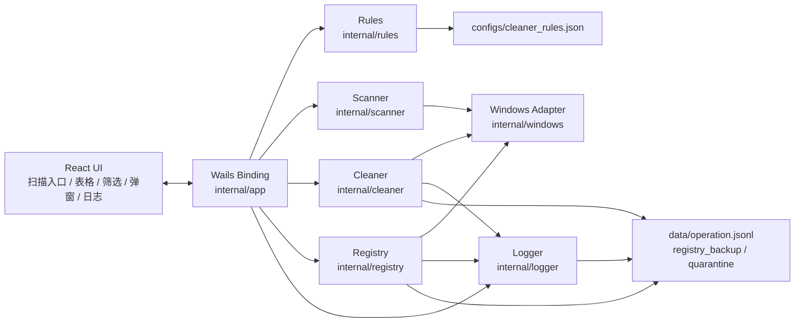
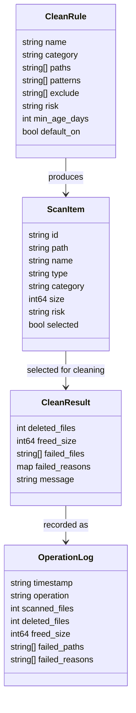
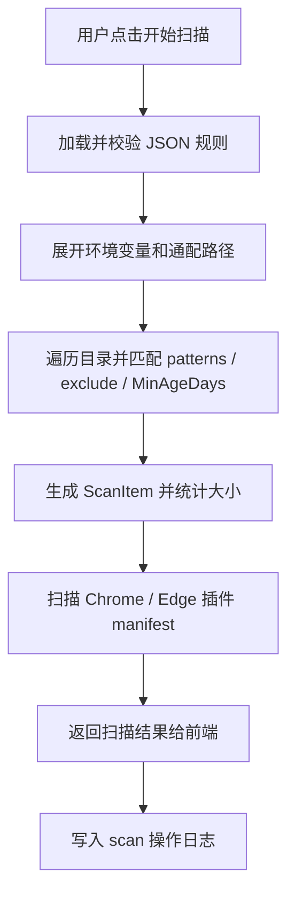
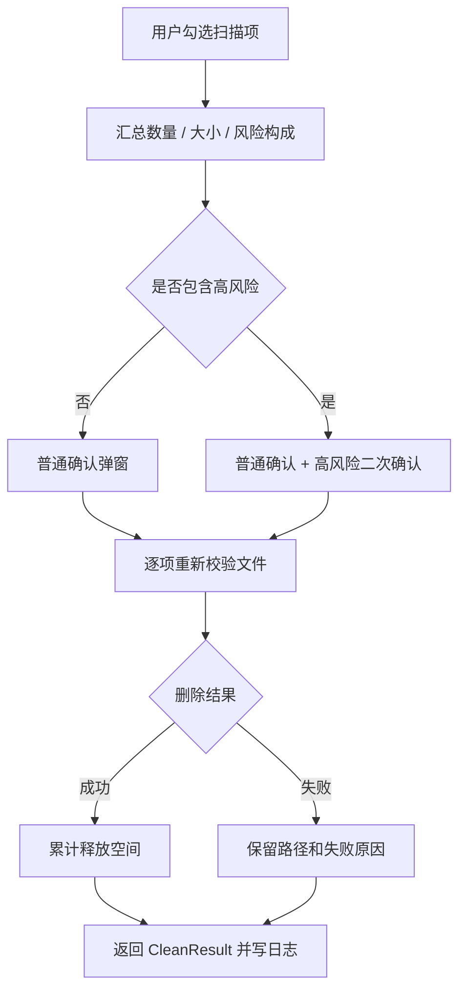
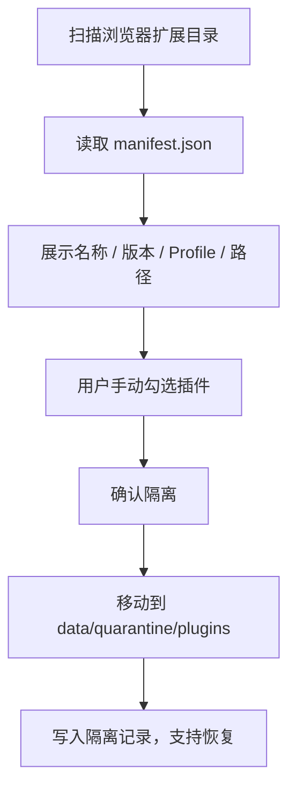
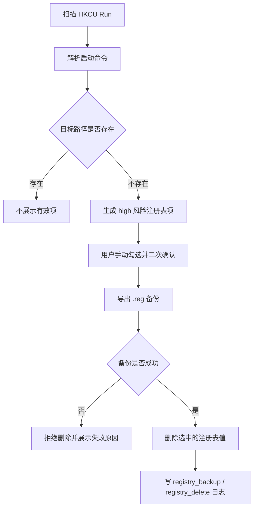
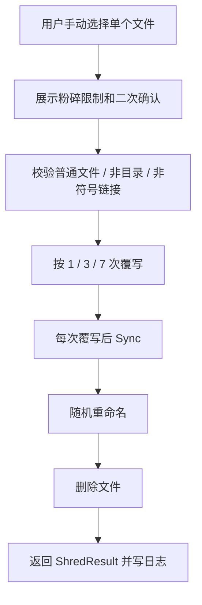

# GoCleaner 系统设计文档

> 版本：v1.0  
> 日期：2026-06-13  
> 阶段：系统设计与交付整理

---

## 1. 设计目标

GoCleaner 面向 Windows 个人电脑空间清理场景，采用“扫描先于清理、预览先于删除、高风险默认不选、失败必须可见、操作必须留痕”的设计原则。系统优先保证课程实训版本可运行、可演示、可测试、可解释，不追求危险的深度清理能力。

核心目标：

```text
1. 通过 JSON 规则扩展文件扫描范围
2. 通过 Go 后端完成扫描、清理、注册表、粉碎和日志记录
3. 通过 Wails + React 提供桌面 UI、确认弹窗、筛选和日志展示
4. 对系统目录、注册表、文件粉碎等高风险操作设置明确边界
```

## 2. 总体架构



系统分为前端 UI、Wails 绑定层、核心业务模块和数据文件四层。Wails 绑定层只负责接收前端参数、调用后端服务、返回结果，不承载复杂业务逻辑。扫描和清理逻辑集中在 `internal/` 下，便于单元测试。

## 3. 模块设计

| 模块 | 目录 | 职责 |
| --- | --- | --- |
| UI | `frontend/src` | 扫描入口、结果表格、分类筛选、风险标签、确认弹窗、结果反馈、日志展示 |
| 绑定层 | `internal/app` | 暴露 Wails 方法，串联规则加载、扫描、清理、注册表、粉碎和日志 |
| 规则加载 | `internal/rules` | 加载 JSON 规则，校验路径、风险等级、匹配模式和敏感数据边界 |
| 文件扫描 | `internal/scanner` | 展开环境变量，遍历目录，匹配文件，统计大小，扫描插件 manifest |
| 清理执行 | `internal/cleaner` | 删除普通文件、记录失败原因、插件隔离、文件粉碎 |
| 注册表 | `internal/registry` | 限定扫描 HKCU Run，无效启动项识别，删除前导出 `.reg` 备份 |
| Windows 封装 | `internal/windows` | 环境变量展开和注册表访问封装 |
| 日志 | `internal/logger` | JSONL 操作日志写入与读取 |

## 4. 核心数据结构



`ScanItem` 通过 `type` 区分普通文件、插件和注册表项。普通文件进入清理流程，插件进入隔离流程，注册表项进入备份删除流程，避免不同风险对象混用同一个危险入口。

## 5. 主要流程设计

### 5.1 扫描流程



扫描阶段不执行删除。系统目录访问失败、权限不足、路径不存在均进入 `ScanResult.Errors`，前端展示失败路径和原因。

### 5.2 清理流程



高风险文件不会默认勾选。清理失败时项目保留在结果列表中并取消勾选，便于用户查看失败原因后决定是否重试。

### 5.3 插件隔离流程



插件功能默认只扫描展示，不做启发式“无用插件”判定。隔离是移动目录，不是直接删除。

### 5.4 注册表备份删除流程



注册表功能只处理明确列出的 HKCU 安全范围，禁止全注册表扫描和自动修复。

### 5.5 文件粉碎流程



文件粉碎是教学意义上的覆写删除。UI 和报告都说明 SSD、NTFS 日志、系统缓存、云同步目录等场景无法保证专业取证级不可恢复。

## 6. 风险控制设计

| 风险点 | 控制措施 |
| --- | --- |
| 系统目录误删 | 系统目录规则标记 high，默认不勾选，清理前二次确认 |
| 浏览器敏感数据 | 规则加载阶段拒绝 History、Cookies、Login Data、Web Data、Preferences 等敏感路径 |
| QQ / 微信聊天数据 | 规则只允许日志、缓存、临时文件，禁止聊天记录、图片、文件、数据库 |
| 注册表误修复 | 仅扫描 HKCU Run，删除前导出 `.reg`，备份失败拒绝删除 |
| 插件误删 | 默认只展示，可选移动到隔离区，保留恢复记录 |
| 粉碎误操作 | 只能手动选择单个普通文件，二次确认，不支持批量粉碎 |
| 失败不可见 | 所有失败进入结果面板和 JSONL 日志 |

## 7. 日志设计

操作日志使用 JSONL，默认路径为 `data/operation.jsonl`。每行是一条操作记录，包含时间、操作类型、扫描数、处理数、释放空间、失败路径、失败原因和耗时。

日志用途：

```text
1. 前端日志页面展示最近操作
2. 测试文档记录失败处理证据
3. 实训报告说明操作可审计性
4. 答辩时解释“失败必须可见、操作必须留痕”
```

## 8. 测试设计

测试优先使用临时目录和构造数据，不直接破坏真实系统目录。真实注册表读写测试默认跳过，仅在显式设置 `GOCLEANER_RUN_REAL_REGISTRY_TESTS=1` 时执行。

主要测试命令：

```powershell
go test ./...
go vet ./...
cd frontend
npm run test:summary
npm run build
```

测试覆盖范围：

| 类型 | 覆盖内容 |
| --- | --- |
| 规则加载 | 字段校验、风险等级、敏感路径拒绝、高风险默认不选 |
| 文件扫描 | 模式匹配、大小统计、环境变量、通配符、排除规则、最小年龄 |
| 清理失败 | 缺失文件、非普通文件、权限不足、文件占用 |
| 插件扫描 | manifest 读取、多版本选择、坏 manifest 继续扫描 |
| 注册表 | 启动命令解析、备份格式、备份失败拒绝删除、真实注册表显式开关 |
| 文件粉碎 | 确认要求、非法 passes、目录/符号链接拒绝、覆写删除流程 |

## 9. 交付说明

第 19 天交付文档包括：

```text
docs/系统分析文档.md
docs/系统设计文档.md
docs/实现与测试文档.md
docs/实训报告.md
docs/images/
```

截图素材优先来自 Wails 桌面应用。当前环境未注入 Wails 后端绑定，因此 `docs/images/` 中的截图主要用于报告排版和答辩说明；正式演示时应在 Wails 桌面运行环境中补拍真实扫描、清理和日志页面截图，并保留同名文件便于报告引用。
